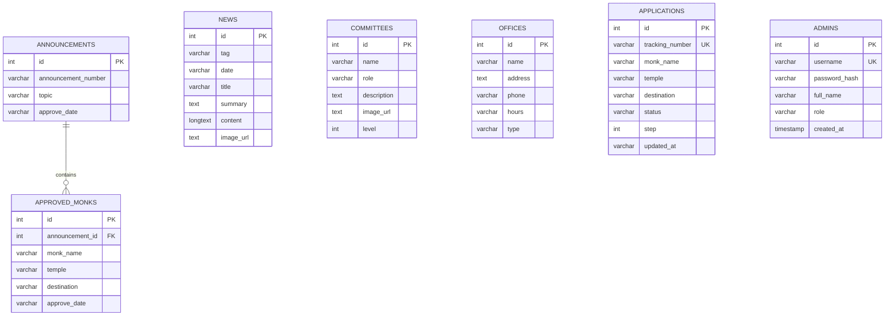

# โครงสร้างฐานข้อมูล (Database Documentation)

ระบบ **ศ.ต.ภ. (SOTOPO)** ใช้ระบบจัดการฐานข้อมูลเชิงสัมพันธ์ (RDBMS) MySQL / MariaDB เป็นฐานข้อมูลหลัก และรองรับ SQLite สำหรับการทำงานแบบ Standalone/Offline

- **ชื่อฐานข้อมูลเริ่มต้น**: `sotopo`
- **ชุดอักขระ (Charset)**: `utf8mb4`
- **การจัดเรียง (Collation)**: `utf8mb4_unicode_ci`
- **Storage Engine**: `InnoDB`

---

## 📊 แผนภาพความสัมพันธ์ฐานข้อมูล (Entity-Relationship Diagram)

---

## 📋 รายละเอียดตารางฐานข้อมูล (Data Dictionary)

### 1. ตาราง `news` (ข่าวสารและกิจกรรม)
เก็บข้อมูลข่าวประชาสัมพันธ์ มติมหาเถรสมาคม และบทความสาระน่ารู้

| ฟิลด์ (Field) | ชนิดข้อมูล (Type) | Nullable | Key | คำอธิบาย |
|---|---|---|---|---|
| `id` | `INT` | NO | `PRIMARY KEY` | รหัสข่าวสาร (Auto Increment) |
| `tag` | `VARCHAR(255)` | NO | - | หมวดหมู่ข่าว (เช่น ข่าวสาร, ประกาศ, สาระน่ารู้, การอบรม, มติมส.) |
| `date` | `VARCHAR(255)` | NO | - | วันที่เผยแพร่ข่าว (เช่น "๑๒ กรกฎาคม ๒๕๖๙") |
| `title` | `VARCHAR(255)` | NO | - | หัวข้อข่าว |
| `summary` | `TEXT` | NO | - | ข้อความสรุปย่อ |
| `content` | `LONGTEXT` | NO | - | เนื้อหาข่าวฉบับเต็มในรูปแบบ HTML Rich Text |
| `image_url` | `TEXT` | NO | - | ที่อยู่ไฟล์ภาพประกอบข่าว |

---

### 2. ตาราง `committees` (คณะกรรมการ ศ.ต.ภ.)
เก็บทำเนียบคณะกรรมการศูนย์ควบคุมการไปต่างประเทศของพระภิกษุสามเณร

| ฟิลด์ (Field) | ชนิดข้อมูล (Type) | Nullable | Key | คำอธิบาย |
|---|---|---|---|---|
| `id` | `INT` | NO | `PRIMARY KEY` | รหัสกรรมการ (Auto Increment) |
| `name` | `VARCHAR(255)` | NO | - | นามสมณศักดิ์และฉายา/นามสกุล |
| `role` | `VARCHAR(255)` | NO | - | ตำแหน่งใน ศ.ต.ภ. (เช่น ประธาน, รองประธาน, กรรมการ) |
| `description` | `TEXT` | NO | - | ตำแหน่งทางคณะสงฆ์และประวัติย่อ |
| `image_url` | `TEXT` | NO | - | ที่อยู่ไฟล์รูปภาพประจำตัว |
| `level` | `INT` | NO | - | ลำดับชั้นการบริหารสำหรับจัดเรียง (1 = ประธาน, 2 = รองประธาน, 3 = กรรมการ) |

---

### 3. ตาราง `announcements` (ประกาศมติ ศ.ต.ภ.)
เก็บหัวข้อและเลขที่ประกาศการอนุมัติเดินทาง

| ฟิลด์ (Field) | ชนิดข้อมูล (Type) | Nullable | Key | คำอธิบาย |
|---|---|---|---|---|
| `id` | `INT` | NO | `PRIMARY KEY` | รหัสประกาศ (Auto Increment) |
| `announcement_number` | `VARCHAR(255)` | NO | - | เลขที่ประกาศ (เช่น "ศ.ต.ภ. ๕/๒๕๖๙") |
| `topic` | `VARCHAR(255)` | NO | - | หัวข้อเรื่องของประกาศ |
| `approve_date` | `VARCHAR(255)` | NO | - | วันที่มติเห็นชอบ |

---

### 4. ตาราง `approved_monks` (รายชื่อพระภิกษุที่ได้รับอนุมัติ)
เก็บรายชื่อพระภิกษุสามเณรที่ได้รับอนุมัติในแต่ละประกาศ

| ฟิลด์ (Field) | ชนิดข้อมูล (Type) | Nullable | Key | คำอธิบาย |
|---|---|---|---|---|
| `id` | `INT` | NO | `PRIMARY KEY` | รหัสรายการ (Auto Increment) |
| `announcement_id` | `INT` | NO | `FOREIGN KEY` | อ้างอิงไปยัง `announcements.id` (ON DELETE CASCADE) |
| `monk_name` | `VARCHAR(255)` | NO | - | นามสมณศักดิ์ ฉายา หรือชื่อพระภิกษุ |
| `temple` | `VARCHAR(255)` | NO | - | วัดต้นสังกัดในประเทศไทย |
| `destination` | `VARCHAR(255)` | NO | - | วัดหรือสถานที่ปลายทางในต่างประเทศ |
| `approve_date` | `VARCHAR(255)` | NO | - | วันที่อนุมัติ |

---

### 5. ตาราง `offices` (ข้อมูลที่ตั้งสำนักงาน)
เก็บข้อมูลสถานที่ตั้ง เบอร์โทรศัพท์ และเวลาทำการของสำนักงานและศูนย์ประสานงาน

| ฟิลด์ (Field) | ชนิดข้อมูล (Type) | Nullable | Key | คำอธิบาย |
|---|---|---|---|---|
| `id` | `INT` | NO | `PRIMARY KEY` | รหัสสำนักงาน (Auto Increment) |
| `name` | `VARCHAR(255)` | NO | - | ชื่อสำนักงานหรือศูนย์ประสานงาน |
| `address` | `TEXT` | NO | - | ที่อยู่และสถานที่ตั้ง |
| `phone` | `VARCHAR(255)` | NO | - | เบอร์โทรศัพท์ติดต่อ |
| `hours` | `VARCHAR(255)` | NO | - | เวลาทำการ |
| `type` | `VARCHAR(255)` | NO | - | ประเภท (เช่น "สำนักงานใหญ่", "ศูนย์ประสานงาน") |

---

### 6. ตาราง `applications` (คำขอยื่นเรื่องและติดตามสถานะ)
เก็บข้อมูลคำขอเดินทางไปต่างประเทศที่ยื่นผ่านระบบออนไลน์

| ฟิลด์ (Field) | ชนิดข้อมูล (Type) | Nullable | Key | คำอธิบาย |
|---|---|---|---|---|
| `id` | `INT` | NO | `PRIMARY KEY` | รหัสคำขอ (Auto Increment) |
| `tracking_number` | `VARCHAR(255)` | NO | `UNIQUE` | รหัสติดตามคำขอ (เช่น "ST-2026-0001") |
| `monk_name` | `VARCHAR(255)` | NO | - | ชื่อพระภิกษุผู้ยื่นคำขอ |
| `temple` | `VARCHAR(255)` | NO | - | วัดต้นสังกัด |
| `destination` | `VARCHAR(255)` | NO | - | วัดหรือประเทศปลายทาง |
| `status` | `VARCHAR(255)` | NO | - | ข้อความสถานะปัจจุบัน |
| `step` | `INT` | NO | - | ขั้นตอนการดำเนินงาน (ค่า 1 ถึง 4) |
| `updated_at` | `VARCHAR(255)` | NO | - | วันที่และเวลาที่อัปเดตสถานะล่าสุด |

#### ความหมายของค่า `step`:
- `1` = ยื่นคำขอเข้าระบบ / รอตรวจสอบเอกสาร
- `2` = ตรวจสอบคุณสมบัติและความถูกต้อง
- `3` = เสนอคณะกรรมการ ศ.ต.ภ. พิจารณา
- `4` = ได้รับการอนุมัติ / ออกหนังสือรับรองเรียบร้อย

---

### 7. ตาราง `admins` (บัญชีผู้ดูแลระบบและเจ้าหน้าที่)
เก็บข้อมูลบัญชีผู้ใช้งานระบบหลังบ้าน (Admin Back-Office)

| ฟิลด์ (Field) | ชนิดข้อมูล (Type) | Nullable | Key | คำอธิบาย |
|---|---|---|---|---|
| `id` | `INT` | NO | `PRIMARY KEY` | รหัสผู้ดูแลระบบ (Auto Increment) |
| `username` | `VARCHAR(100)` | NO | `UNIQUE` | ชื่อผู้ใช้งานสำหรับเข้าสู่ระบบ |
| `password_hash` | `VARCHAR(255)` | NO | - | รหัสผ่านที่เข้ารหัสด้วย `password_hash` (BCrypt) |
| `full_name` | `VARCHAR(255)` | NO | - | ชื่อ-นามสกุล หรือตำแหน่งผู้ดูแลระบบ |
| `role` | `VARCHAR(50)` | NO | - | ระดับสิทธิ์ (เช่น `superadmin`, `admin`, `staff`) |
| `created_at` | `TIMESTAMP` | NO | - | วันที่และเวลาที่สร้างบัญชี |

---

## 💾 ไฟล์ Schema และ Data Seed

ไฟล์ SQL ทั้งหมดบรรจุอยู่ใน [mysql.sql](./mysql.sql)
- รวมคำสั่ง `CREATE TABLE` ทั้ง 7 ตาราง
- มีข้อมูลตัวอย่าง (Seed Data) ครบถ้วนพร้อมใช้งานทันที รวมถึงบัญชีแอดมินเริ่มต้น (`admin` / `admin123`)
