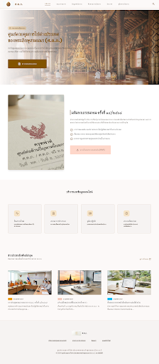
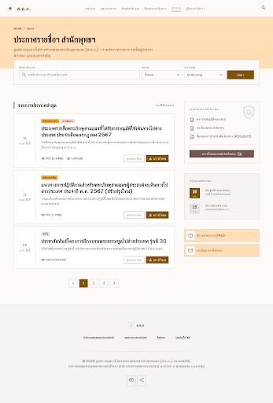
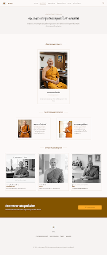
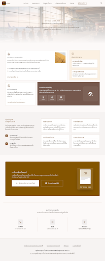

# ศ.ต.ภ. - ศูนย์ควบคุมการไปต่างประเทศของพระภิกษุสามเณร (SOTOPO)

ระบบสารสนเทศและการให้บริการออนไลน์ ศูนย์ควบคุมการไปต่างประเทศของพระภิกษุสามเณร (ศ.ต.ภ.) ภายใต้มหาเถรสมาคม สำหรับการบริหารจัดการ ติดตามสถานะคำขอเดินทาง ประกาศผลการอนุมัติ เผยแพร่ข้อมูลข่าวสารพระธรรมทูตสายต่างประเทศ และระบบหลังบ้านสำหรับเจ้าหน้าที่ (Admin Back-Office)

---

## 📸 ภาพรวมระบบ (Screenshots)

| หน้าแรก (Home & Tracking) | ประกาศผลการอนุมัติ (Announcements) |
|:---:|:---:|
|  |  |

| คณะกรรมการ ศ.ต.ภ. (Committee) | ขั้นตอนการขอหนังสือเดินทางและวีซ่า (Guidelines) |
|:---:|:---:|
|  |  |

---

## ✨ ฟีเจอร์หลักของระบบ (Key Features)

### ฝั่งหน้าบ้าน (Public Portal)
1. **ระบบประชาสัมพันธ์และข่าวสาร (News & Activities)**
   - แสดงข่าวสาร มติมหาเถรสมาคม กิจกรรมการประชุม และหลักสูตรอบรมพระธรรมทูต
   - รองรับการกรองตามหมวดหมู่ (Tag) ค้นหาคำสำคัญ (Search) และอ่านเนื้อหาฉบับเต็มผ่าน Modal แบบ Rich HTML

2. **ระบบติดตามสถานะคำขอออนไลน์ (Real-time Tracking)**
   - ตรวจสอบสถานะการยื่นคำร้องผ่านรหัสติดตาม (Tracking Number เช่น `ST-2026-0001`)
   - แสดงสถานะกระบวนการทำงาน 4 ขั้นตอน (ยื่นคำร้อง ➜ ตรวจสอบเอกสาร ➜ เสนอคณะกรรมการ ➜ อนุมัติออกหนังสือ)

3. **ระบบยื่นคำร้องขออนุมัติออนไลน์ (Online Application Submission)**
   - ฟอร์มยื่นคำร้องขอเดินทางไปต่างประเทศสำหรับพระภิกษุสามเณร
   - บันทึกข้อมูลและออกรหัสติดตามอัตโนมัติลงในฐานข้อมูล MySQL

4. **ทำเนียบคณะกรรมการ ศ.ต.ภ. (Executive & Committee Directory)**
   - แสดงรายนามประธาน รองประธาน และกรรมการ ศ.ต.ภ. พร้อมตำแหน่งและรูปภาพ

5. **ทะเบียนประกาศผลการอนุมัติ (Approved Monks Registry)**
   - ตรวจสอบรายชื่อพระภิกษุสามเณรที่ได้รับอนุมัติเดินทางไปต่างประเทศ
   - ระบบค้นหาอัจฉริยะ (ค้นหาตามชื่อพระ, วัดต้นสังกัด, ประเทศปลายทาง หรือเลขที่ประกาศ) พร้อมระบบแบ่งหน้า (Pagination)

6. **ข้อมูลสำนักงานและจุดประสานงาน (Offices & Contact Info)**
   - ข้อมูลที่ตั้งสำนักงานใหญ่ (วัดสระเกศราชวรมหาวิหาร) และศูนย์ประสานงาน (วัดประยุรวงศาวาสวรวิหาร) พร้อมเบอร์ติดต่อและเวลาทำการ

7. **คู่มือและแบบฟอร์มเอกสาร (Guides & Form Downloads)**
   - ข้อมูลขั้นตอนการขอหนังสือเดินทางเล่มสีน้ำเงิน (Official Passport) และการขอวีซ่าประเภททางศาสนา (Religious Visa)
   - แหล่งดาวน์โหลดแบบฟอร์มคำขอและระเบียบมหาเถรสมาคมที่เกี่ยวข้อง

---

### ฝั่งหลังบ้านสำหรับเจ้าหน้าที่ (Admin Back-Office) 🔐
- **URL เข้าสู่ระบบ**: `#/admin`
- **บัญชีเริ่มต้น (Default Credentials)**:
  - **ชื่อผู้ใช้งาน (Username)**: `admin`
  - **รหัสผ่าน (Password)**: `admin123`
- **ฟังก์ชันการทำงานของ Admin**:
  1. **แผงควบคุมภาพรวม (Dashboard)**: แสดงสถิติตัวเลขสรุปคำขอ, สถานะ Pipeline 4 ขั้นตอน, รายการคำขอล่าสุด
  2. **จัดการคำขอเดินทาง (Applications CRUD)**: ค้นหา, กรองตาม Step 1-4, เปลี่ยนสถานะ/ขั้นตอนด่วน, เพิ่ม/แก้ไข/ลบ
  3. **จัดการข่าวสารและกิจกรรม (News CRUD)**: สร้าง แก้ไข ลบข่าวสาร กำหนด Tag และแก้ไขเนื้อหา Rich HTML
  4. **จัดการประกาศผลมติและรายชื่อพระภิกษุ (Announcements & Approved Monks CRUD)**: สร้างประกาศพร้อมเพิ่ม/แก้ไขรายชื่อพระภิกษุในแต่ละประกาศ
  5. **จัดการทำเนียบคณะกรรมการ (Committees CRUD)**: เพิ่ม/แก้ไข/ลบ และจัดลำดับผู้บริหาร
  6. **จัดการข้อมูลสำนักงาน (Offices CRUD)**: ปรับปรุงที่ตั้ง เบอร์ติดต่อ และเวลาทำการ
  7. **ตั้งค่าบัญชีและรหัสผ่าน (Settings)**: เปลี่ยนชื่อผู้ดูแลระบบและรหัสผ่านความปลอดภัย

---

## 🛠️ สถาปัตยกรรมและเทคโนโลยีที่ใช้ (Tech Stack)

### Frontend
- **Framework / Library**: React 19 + TypeScript
- **Build Tool**: Vite 6
- **Styling**: Tailwind CSS (Material Design 3 & Warm Saffron Buddhist Color Palette)
- **Icons & Typography**: Google Material Symbols Outlined, Google Fonts (`Sarabun`, `Be Vietnam Pro`)
- **Routing**: Client-side Hash Routing (`#/`, `#/committee`, `#/office`, `#/visa`, `#/announcements`, `#/guide`, `#/admin`)

### Backend
- **Language**: PHP 8.x
- **Database Engine**: MySQL 8.x / MariaDB (รองรับ Fallback SQLite)
- **Database Driver**: PDO (PHP Data Objects) with Prepared Statements & Token Authentication
- **Architecture**: Lightweight RESTful JSON API (`backend/api.php`)
- **Security & Config**: Environment variables (`.env`), Password Hashing (BCrypt), CORS headers

---

## 📁 โครงสร้างโปรเจกต์ (Project Structure)

```text
sotopo/
├── .env                  # การตั้งค่า Environment (Database & Config)
├── .env.example          # ตัวอย่างไฟล์ตั้งค่า Environment
├── .gitignore            # Git ignore rules
├── API.md                # รายละเอียดและ Specification ของ REST API
├── CHANGELOG.md          # ประวัติการอัปเดตและรุ่นของโปรเจกต์
├── CONTRIBUTING.md       # ข้อตกลงและแนวทางการพัฒนาโค้ด
├── DATABASE.md           # โครงสร้างฐานข้อมูล Data Dictionary & ER Diagram
├── README.md             # เอกสารคู่มือโปรเจกต์หลัก
├── SETUP.md              # คู่มือการติดตั้งและรันโปรเจกต์แบบละเอียด
├── index.html            # Entry HTML พร้อม Tailwind config & Web Fonts
├── mysql.sql             # SQL Schema & Seed Data สำหรับนำเข้า MySQL
├── package.json          # Node.js dependencies & scripts
├── tsconfig.json         # TypeScript configuration
├── vite.config.ts        # Vite configuration
├── backend/              # ฝั่ง Backend API
│   ├── README.md         # คู่มือการทำงานของ Backend PHP
│   └── api.php           # REST API Endpoint หลัก
├── public/               # Static Assets
│   ├── images/           # รูปภาพโลโก้ กรรมการ ข่าวสาร และสถานที่
│   └── screenshots/      # ภาพแคปเจอร์หน้าจอระบบ
└── src/                  # React Application Source Code
    ├── App.tsx           # หน้าเว็บหลักและการ Routing
    ├── admin/            # โมดูลระบบหลังบ้าน (Admin Back-Office)
    │   ├── AdminApp.tsx           # Main Admin Router & Auth Guard
    │   ├── AdminLayout.tsx        # Sidebar & Topbar Layout
    │   ├── AdminLogin.tsx         # หน้าเข้าสู่ระบบเจ้าหน้าที่
    │   ├── AdminDashboard.tsx     # แผงสถิติภาพรวม
    │   ├── AdminApplications.tsx  # จัดการคำขอเดินทาง (CRUD & Step Change)
    │   ├── AdminNews.tsx          # จัดการข่าวสารและบทความ
    │   ├── AdminAnnouncements.tsx # จัดการประกาศและรายชื่อพระภิกษุ
    │   ├── AdminCommittees.tsx    # จัดการคณะกรรมการ
    │   ├── AdminOffices.tsx       # จัดการสำนักงาน
    │   ├── AdminSettings.tsx      # ตั้งค่ารหัสผ่านและโปรไฟล์
    │   ├── adminApi.ts            # Client API Helper & Token Manager
    │   └── adminTypes.ts          # TypeScript Type Definitions
    ├── main.tsx          # React Root Mounting
    └── vite-env.d.ts     # Vite TypeScript type declarations
```

---

## 🚀 การติดตั้งและเริ่มต้นใช้งาน (Quick Start)

### 1. ความต้องการของระบบ (Prerequisites)
- [Node.js](https://nodejs.org/) (Version 18.0 ขึ้นไป)
- [PHP](https://www.php.net/) (Version 8.0 ขึ้นไป)
- [MySQL](https://www.mysql.com/) หรือ [MariaDB](https://mariadb.org/) (หรือใช้ผ่าน XAMPP / MAMP / Laragon)

### 2. ติดตั้ง Dependencies
```bash
npm install
```

### 3. ตั้งค่าฐานข้อมูล (Database Setup)
1. เปิด XAMPP หรือ MySQL Server
2. สร้างฐานข้อมูล `sotopo` หรือรันคำสั่งจากไฟล์ `mysql.sql`:
   ```bash
   mysql -u root -p < mysql.sql
   ```
3. คัดลอกและตั้งค่า `.env`:
   ```bash
   cp .env.example .env
   ```

### 4. สตาร์ทโปรเจกต์ (Running Locally)

**ฝั่ง Frontend (Vite Dev Server):**
```bash
npm run dev
```
เปิดบราวเซอร์ไปที่:
- หน้าเว็บสาธารณะ: `http://localhost:5173/#/`
- หน้าหลังบ้าน Admin: `http://localhost:5173/#/admin` (เข้าด้วย `admin` / `admin123`)

---

## 📚 เอกสารเพิ่มเติม (Documentation)

- 📖 [คู่มือการติดตั้งและการตั้งค่าสภาพแวดล้อม (SETUP.md)](./SETUP.md)
- 🔌 [เอกสาร API Specifications (API.md)](./API.md)
- 🗄️ [โครงสร้างฐานข้อมูลและตาราง (DATABASE.md)](./DATABASE.md)
- 🖥️ [คู่มือการทำงานของ Backend PHP (backend/README.md)](./backend/README.md)
- 🤝 [แนวทางการมีส่วนร่วมและพัฒนา (CONTRIBUTING.md)](./CONTRIBUTING.md)
- 📝 [บันทึกประวัติการเปลี่ยนแปลง (CHANGELOG.md)](./CHANGELOG.md)

---

## 📄 ใบอนุญาต (License)

โปรเจกต์นี้พัฒนาขึ้นเพื่อการใช้งานของ **ศูนย์ควบคุมการไปต่างประเทศของพระภิกษุสามเณร (ศ.ต.ภ.)** สงวนลิขสิทธิ์ตามระเบียบมหาเถรสมาคม
