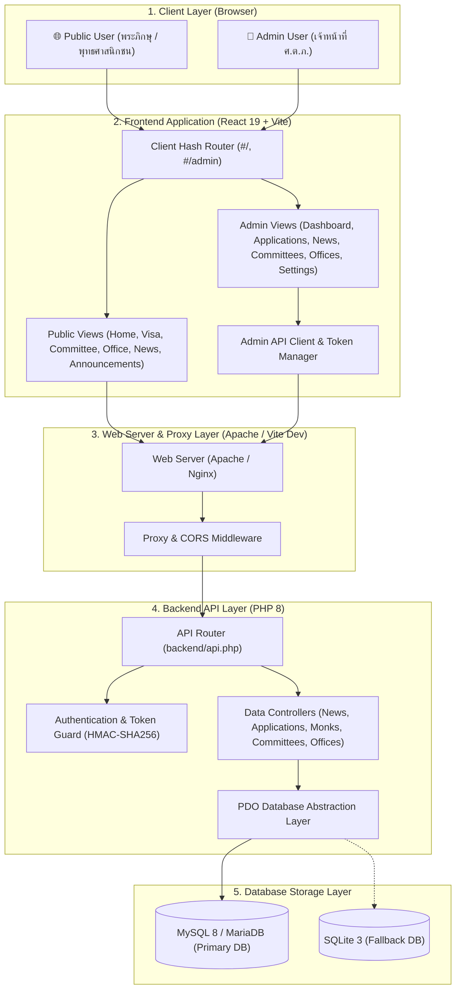
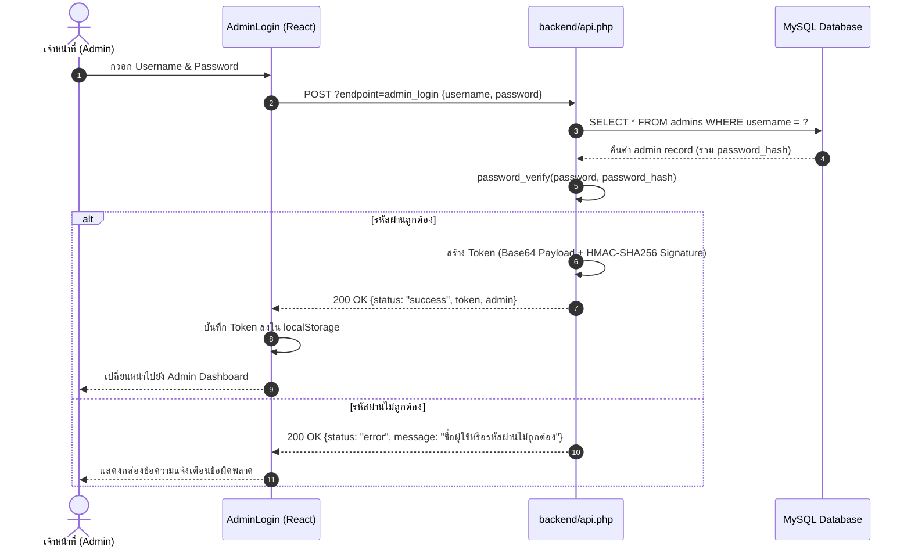

# สถาปัตยกรรมระบบ (System Architecture Document)

## ระบบศูนย์ควบคุมการไปต่างประเทศของพระภิกษุสามเณร (ศ.ต.ภ.)
**Architecture Design & Technical Specifications**

---

## 🏛️ 1. ภาพรวมสถาปัตยกรรมระบบ (High-Level Architecture)

ระบบ **ศ.ต.ภ. (SOTOPO)** ออกแบบตามสถาปัตยกรรม **Decoupled Client-Server (SPA + REST API)** โดยแยกชั้นการประมวลผลส่วนหน้า (Frontend Single Page Application) ออกจากส่วนบริการข้อมูล (Backend RESTful API) อย่างชัดเจน



---

## 🧩 2. โครงสร้างสถาปัตยกรรมฝั่ง Client (Client-Side Architecture)

### 2.1 เทคโนโลยีหลัก
- **React 19**: Component-based UI Library
- **TypeScript 5.7**: Strict Static Typing
- **Vite 6**: Next-Generation Module Bundler
- **Tailwind CSS**: Utility-first CSS Engine with Dynamic Theme Injection

### 2.2 โครงสร้างโมดูล (Module Structure)
```text
src/
├── App.tsx             # Main App, Hash Router & Public Pages
├── main.tsx            # Application Entry Point
├── vite-env.d.ts       # Vite TypeScript Environment
└── admin/              # Admin Subsystem Module
    ├── AdminApp.tsx           # Admin Router & Auth State Guard
    ├── AdminLayout.tsx        # Responsive Sidebar & Topbar Shell
    ├── AdminLogin.tsx         # Secure Authentication Form
    ├── AdminDashboard.tsx     # Metrics & Workflow Pipeline Overview
    ├── AdminApplications.tsx  # Applications Management & Fast Step Selector
    ├── AdminNews.tsx          # News Management & Rich Content Editor
    ├── AdminAnnouncements.tsx # Announcements & Monks List Sub-form
    ├── AdminCommittees.tsx    # Committees Directory Management
    ├── AdminOffices.tsx       # Offices Directory Management
    ├── AdminSettings.tsx      # Profile & Password Settings
    ├── adminApi.ts            # Typed Fetch Client & Token Storage
    └── adminTypes.ts          # Admin TypeScript Interfaces
```

---

## ⚙️ 3. โครงสร้างสถาปัตยกรรมฝั่ง Server (Server-Side Architecture)

### 3.1 เทคโนโลยีหลัก
- **PHP 8.x**: Fast, lightweight server-side execution
- **PDO Driver**: Robust SQL database abstraction with parameter binding
- **RESTful Endpoints**: Single-entry point (`backend/api.php`) with action routing

### 3.2 ระบบยืนยันตัวตนและความปลอดภัย (Security Architecture)


---

## 🔒 4. มาตรการความปลอดภัยของระบบ (Security Standards)

1. **SQL Injection Prevention**: ใช้ PDO Prepared Statements ในทุก Query 100%
2. **Password Security**: เข้ารหัสรหัสผ่านด้วย `password_hash($pass, PASSWORD_BCRYPT)` มาตรฐานความปลอดภัยสากล
3. **API Access Control**: มี Middleware ตรวจสอบ Bearer Token ในทุก Endpoint ที่มีการเปลี่ยนแปลงข้อมูล (POST/DELETE)
4. **CORS Hardening**: จัดการ Headers อย่างปลอดภัย รองรับการเรียกข้ามโดเมนที่กำหนด
5. **Data Sanitization**: ตรวจสอบและกรองข้อมูลนำเข้า (`trim()`, `intval()`, `json_decode`) ก่อนบันทึกเข้าสู่ฐานข้อมูล
