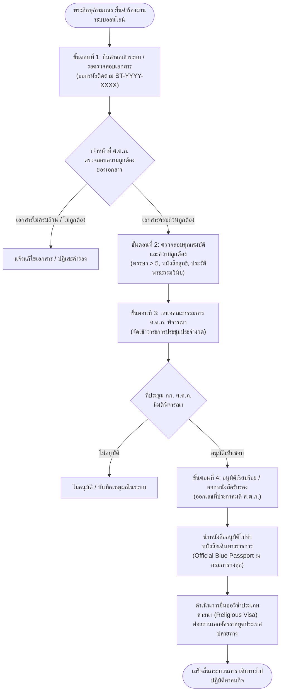

# กระบวนการทำงานและขั้นตอนการปฏิบัติงาน (Business Process & Workflow Specifications)

## ศูนย์ควบคุมการไปต่างประเทศของพระภิกษุสามเณร (ศ.ต.ภ.)
**Operational Workflows, Approval Pipelines & Standard Operating Procedures (SOP)**

---

## 🔄 1. ผังกระบวนการขออนุมัติเดินทางไปต่างประเทศ (4-Step Approval Pipeline)

---

## 📋 2. รายละเอียดแต่ละขั้นตอนการดำเนินงาน (Process Details)

### ขั้นตอนที่ 1: ยื่นคำขอเข้าระบบและรับรหัสติดตาม (Application Submission)
- **ผู้รับผิดชอบ**: พระภิกษุสามเณรผู้ขอเดินทาง หรือเจ้าหน้าที่วัดต้นสังกัด
- **ช่องทาง**: ระบบเว็บไซต์ ศ.ต.ภ. ออนไลน์ (`#/` -> คลิก "ยื่นคำร้องขออนุมัติออนไลน์")
- **ข้อมูลที่ต้องบันทึก**: นามสมณศักดิ์/ชื่อ-ฉายา, วัดต้นสังกัดในประเทศไทย, วัดหรือประเทศปลายทาง
- **ผลลัพธ์**: ระบบสร้างรหัสติดตามอัตโนมัติ (เช่น `ST-2026-0001`) และบันทึกสถานะลงในฐานข้อมูล

### ขั้นตอนที่ 2: ตรวจสอบคุณสมบัติและเอกสาร (Document & Eligibility Verification)
- **ผู้รับผิดชอบ**: เจ้าหน้าที่ ศ.ต.ภ. ส่วนกลาง
- **เกณฑ์การตรวจสอบคุณสมบัติ**:
  1. พรรษาพ้น 5 พรรษา (มีนิสัยมุตตกะ) ตามพระธรรมวินัย
  2. ได้รับความยินยอมและหนังสือรับรองจากเจ้าอาวาสและเจ้าคณะผู้ปกครองตามลำดับ
  3. มีหนังสือเชิญหรือหนังสือตอบรับจากวัดไทยหรือองค์กรศาสนาในต่างประเทศ
  4. ตรวจสอบความถูกต้องของหนังสือสุทธิและบัตรประจำตัวประชาชน
- **ผลลัพธ์**: ปรับสถานะเป็น **"ขั้นตอนที่ 2: ตรวจสอบเอกสารเสร็จสิ้น กำลังเสนอคณะกรรมการ"**

### ขั้นตอนที่ 3: เสนอคณะกรรมการ ศ.ต.ภ. พิจารณา (Board Review & Deliberation)
- **ผู้รับผิดชอบ**: คณะกรรมการศูนย์ควบคุมการไปต่างประเทศของพระภิกษุสามเณร (ศ.ต.ภ.)
- **การดำเนินงาน**: จัดการประชุมพิจารณาประจำเดือน โดยมีประธานคณะกรรมการ ศ.ต.ภ. เป็นประธานที่ประชุม
- **ผลลัพธ์**: มติเห็นชอบ / ไม่อนุมัติ พร้อมลงนามรับรอง

### ขั้นตอนที่ 4: ประกาศผลและออกหนังสือรับรอง (Approval & Certification)
- **ผู้รับผิดชอบ**: สำนักงาน ศ.ต.ภ. ส่วนกลาง
- **การดำเนินงาน**:
  1. ออกเลขที่ประกาศมติ ศ.ต.ภ. (เช่น `ศ.ต.ภ. ๕/๒๕๖๙`)
  2. เผยแพร่ประกาศผลลงบนระบบเว็บไซต์ (`#/announcements`)
  3. ปรับสถานะคำขอของผู้ยื่นเป็น **"ขั้นตอนที่ 4: อนุมัติเรียบร้อย (รับเอกสารได้ที่ ศ.ต.ภ.)"**
  4. ออกหนังสือรับรองทางการเพื่อนำไปใช้ประกอบการขอหนังสือเดินทางราชการ (Official Passport)

---

## 🛂 3. กระบวนการขอหนังสือเดินทางและวีซ่า (Passport & Visa Protocol)

### การขอหนังสือเดินทางราชการ (Official Passport - เล่มสีน้ำเงิน)
1. นำหนังสืออนุมัติจาก ศ.ต.ภ. หรือมติมหาเถรสมาคม
2. นำหนังสือสุทธิ (ตัวจริงพร้อมสำเนา), บัตรประชาชน และทะเบียนบ้านวัด
3. ยื่นขอทำหนังสือเดินทาง ณ กรมการกงสุล ถนนแจ้งวัฒนะ หรือสำนักงานหนังสือเดินทางชั่วคราว
4. **การยกเว้นค่าธรรมเนียม**: ได้รับการยกเว้นค่าธรรมเนียมตามระเบียบกระทรวงการต่างประเทศสำหรับภารกิจคณะสงฆ์

### การขอวีซ่าทางศาสนา (Religious Worker Visa)
1. ขอหนังสือรับรองสถานะพระภิกษุสงฆ์ฉบับภาษาอังกฤษ (Official Endorsement Letter) จาก ศ.ต.ภ.
2. รวบรวมสัญญาการอุปถัมภ์ (Sponsorship Certificate) และเอกสารจดทะเบียนวัดไทยในต่างแดน
3. ยื่นคำร้องขอวีซ่าต่อสถานทูตประเทศปลายทาง (เช่น วีซ่า R-1 สำหรับสหรัฐอเมริกา หรือ Schengen Religious Visa สำหรับยุโรป)
