# ข้อกำหนดโครงสร้างฐานข้อมูล (Database Schema & Data Model)

## ระบบศูนย์ควบคุมการไปต่างประเทศของพระภิกษุสามเณร (ศ.ต.ภ.)
**Database Schema, Entity Relationships & DDL Specifications**

---

## 📊 1. แผนภาพความสัมพันธ์เชิงเอนทิตี (ER Diagram)

```mermaid
erDiagram
    ANNOUNCEMENTS ||--o{ APPROVED_MONKS : "contains"

    NEWS {
        int id PK "รหัสข่าวสาร (Auto Increment)"
        varchar tag "หมวดหมู่ข่าวสาร"
        varchar date "วันที่เผยแพร่ข่าว"
        varchar title "หัวข้อข่าว"
        text summary "สรุปย่อข่าวสาร"
        longtext content "เนื้อหาข่าวฉบับเต็ม (HTML)"
        text image_url "ลิงก์รูปภาพประกอบ"
    }

    COMMITTEES {
        int id PK "รหัสกรรมการ (Auto Increment)"
        varchar name "ชื่อ/สมณศักดิ์"
        varchar role "ตำแหน่งใน ศ.ต.ภ."
        text description "ตำแหน่งปกครองสงฆ์/ประวัติย่อ"
        text image_url "รูปภาพประจำตัว"
        int level "ลำดับชั้นบริหาร (1=ประธาน, 2=รอง, 3=กรรมการ)"
    }

    ANNOUNCEMENTS {
        int id PK "รหัสประกาศ (Auto Increment)"
        varchar announcement_number "เลขที่ประกาศมติ (เช่น ศ.ต.ภ. ๕/๒๕๖๙)"
        varchar topic "หัวข้อเรื่องของประกาศ"
        varchar approve_date "วันที่มติเห็นชอบ"
    }

    APPROVED_MONKS {
        int id PK "รหัสรายการ (Auto Increment)"
        int announcement_id FK "อ้างอิงประกาศ (announcements.id)"
        varchar monk_name "ชื่อพระภิกษุสามเณร"
        varchar temple "วัดต้นสังกัดในประเทศ"
        varchar destination "วัด/ประเทศปลายทาง"
        varchar approve_date "วันที่อนุมัติ"
    }

    OFFICES {
        int id PK "รหัสสำนักงาน (Auto Increment)"
        varchar name "ชื่อสำนักงาน/จุดประสานงาน"
        text address "ที่อยู่และสถานที่ตั้ง"
        varchar phone "เบอร์โทรศัพท์ติดต่อ"
        varchar hours "เวลาทำการ"
        varchar type "ประเภท (HQ, BRANCH, OVERSEAS, PARTNER)"
    }

    APPLICATIONS {
        int id PK "รหัสคำขอ (Auto Increment)"
        varchar tracking_number UK "รหัสติดตามคำขอ (เช่น ST-2026-0001)"
        varchar monk_name "ชื่อพระภิกษุผู้ยื่นคำขอ"
        varchar temple "วัดต้นสังกัด"
        varchar destination "วัด/ประเทศปลายทาง"
        varchar status "ข้อความสถานะปัจจุบัน"
        int step "ขั้นตอน (1=ยื่น, 2=ตรวจ, 3=เสนอ กก., 4=อนุมัติ)"
        varchar updated_at "วันที่และเวลาที่อัปเดตล่าสุด"
    }

    ADMINS {
        int id PK "รหัสผู้ดูแลระบบ (Auto Increment)"
        varchar username UK "ชื่อผู้ใช้งานสำหรับ Login"
        varchar password_hash "รหัสผ่านเข้ารหัส BCrypt"
        varchar full_name "ชื่อ-นามสกุล / ตำแหน่งผู้ดูแลระบบ"
        varchar role "ระดับสิทธิ์ (superadmin, admin, staff)"
        timestamp created_at "วันที่สร้างบัญชี"
    }
```



---

## 🗄️ 2. ตารางฐานข้อมูลและ Data Dictionary

### 2.1 ตาราง `news`
```sql
CREATE TABLE IF NOT EXISTS `news` (
  `id` INT AUTO_INCREMENT PRIMARY KEY,
  `tag` VARCHAR(255) NOT NULL,
  `date` VARCHAR(255) NOT NULL,
  `title` VARCHAR(255) NOT NULL,
  `summary` TEXT NOT NULL,
  `content` LONGTEXT NOT NULL,
  `image_url` TEXT NOT NULL
) ENGINE=InnoDB DEFAULT CHARSET=utf8mb4 COLLATE=utf8mb4_unicode_ci;
```

### 2.2 ตาราง `committees`
```sql
CREATE TABLE IF NOT EXISTS `committees` (
  `id` INT AUTO_INCREMENT PRIMARY KEY,
  `name` VARCHAR(255) NOT NULL,
  `role` VARCHAR(255) NOT NULL,
  `description` TEXT NOT NULL,
  `image_url` TEXT NOT NULL,
  `level` INT NOT NULL
) ENGINE=InnoDB DEFAULT CHARSET=utf8mb4 COLLATE=utf8mb4_unicode_ci;
```

### 2.3 ตาราง `announcements`
```sql
CREATE TABLE IF NOT EXISTS `announcements` (
  `id` INT AUTO_INCREMENT PRIMARY KEY,
  `announcement_number` VARCHAR(255) NOT NULL,
  `topic` VARCHAR(255) NOT NULL,
  `approve_date` VARCHAR(255) NOT NULL
) ENGINE=InnoDB DEFAULT CHARSET=utf8mb4 COLLATE=utf8mb4_unicode_ci;
```

### 2.4 ตาราง `approved_monks`
```sql
CREATE TABLE IF NOT EXISTS `approved_monks` (
  `id` INT AUTO_INCREMENT PRIMARY KEY,
  `announcement_id` INT NOT NULL,
  `monk_name` VARCHAR(255) NOT NULL,
  `temple` VARCHAR(255) NOT NULL,
  `destination` VARCHAR(255) NOT NULL,
  `approve_date` VARCHAR(255) NOT NULL,
  FOREIGN KEY (`announcement_id`) REFERENCES `announcements`(`id`) ON DELETE CASCADE
) ENGINE=InnoDB DEFAULT CHARSET=utf8mb4 COLLATE=utf8mb4_unicode_ci;
```

### 2.5 ตาราง `offices`
```sql
CREATE TABLE IF NOT EXISTS `offices` (
  `id` INT AUTO_INCREMENT PRIMARY KEY,
  `name` VARCHAR(255) NOT NULL,
  `address` TEXT NOT NULL,
  `phone` VARCHAR(255) NOT NULL,
  `hours` VARCHAR(255) NOT NULL,
  `type` VARCHAR(255) NOT NULL
) ENGINE=InnoDB DEFAULT CHARSET=utf8mb4 COLLATE=utf8mb4_unicode_ci;
```

### 2.6 ตาราง `applications`
```sql
CREATE TABLE IF NOT EXISTS `applications` (
  `id` INT AUTO_INCREMENT PRIMARY KEY,
  `tracking_number` VARCHAR(255) NOT NULL UNIQUE,
  `monk_name` VARCHAR(255) NOT NULL,
  `temple` VARCHAR(255) NOT NULL,
  `destination` VARCHAR(255) NOT NULL,
  `status` VARCHAR(255) NOT NULL,
  `step` INT NOT NULL,
  `updated_at` VARCHAR(255) NOT NULL
) ENGINE=InnoDB DEFAULT CHARSET=utf8mb4 COLLATE=utf8mb4_unicode_ci;
```

### 2.7 ตาราง `admins`
```sql
CREATE TABLE IF NOT EXISTS `admins` (
  `id` INT AUTO_INCREMENT PRIMARY KEY,
  `username` VARCHAR(100) NOT NULL UNIQUE,
  `password_hash` VARCHAR(255) NOT NULL,
  `full_name` VARCHAR(255) NOT NULL,
  `role` VARCHAR(50) NOT NULL DEFAULT 'admin',
  `created_at` TIMESTAMP DEFAULT CURRENT_TIMESTAMP
) ENGINE=InnoDB DEFAULT CHARSET=utf8mb4 COLLATE=utf8mb4_unicode_ci;
```
